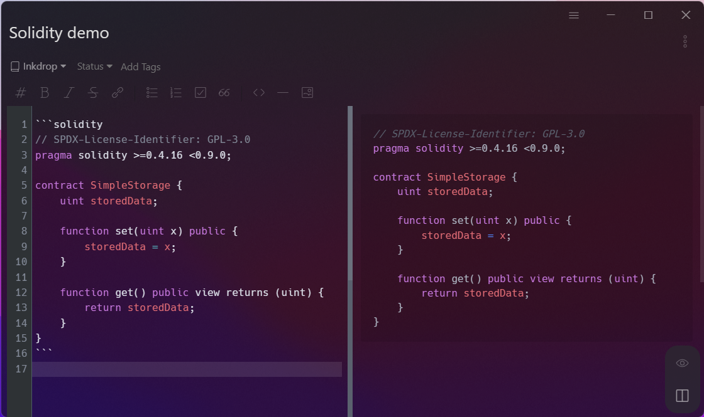

# Solidity mode for Inkdrop

⧫ Solidity's syntax highlight in Inkdrop ⧫


## Usage

Specify a `solidity` tag in fenced code blocks.

````
```solidity
pragma solidity ^0.7.5;

contract MyContract {
    ...
}
```
````

## Changelog

- 1.0.0
  - first release
